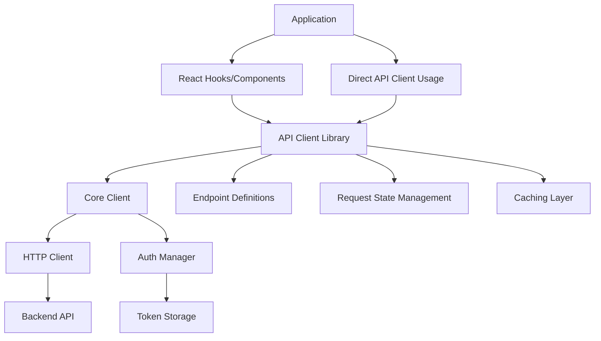
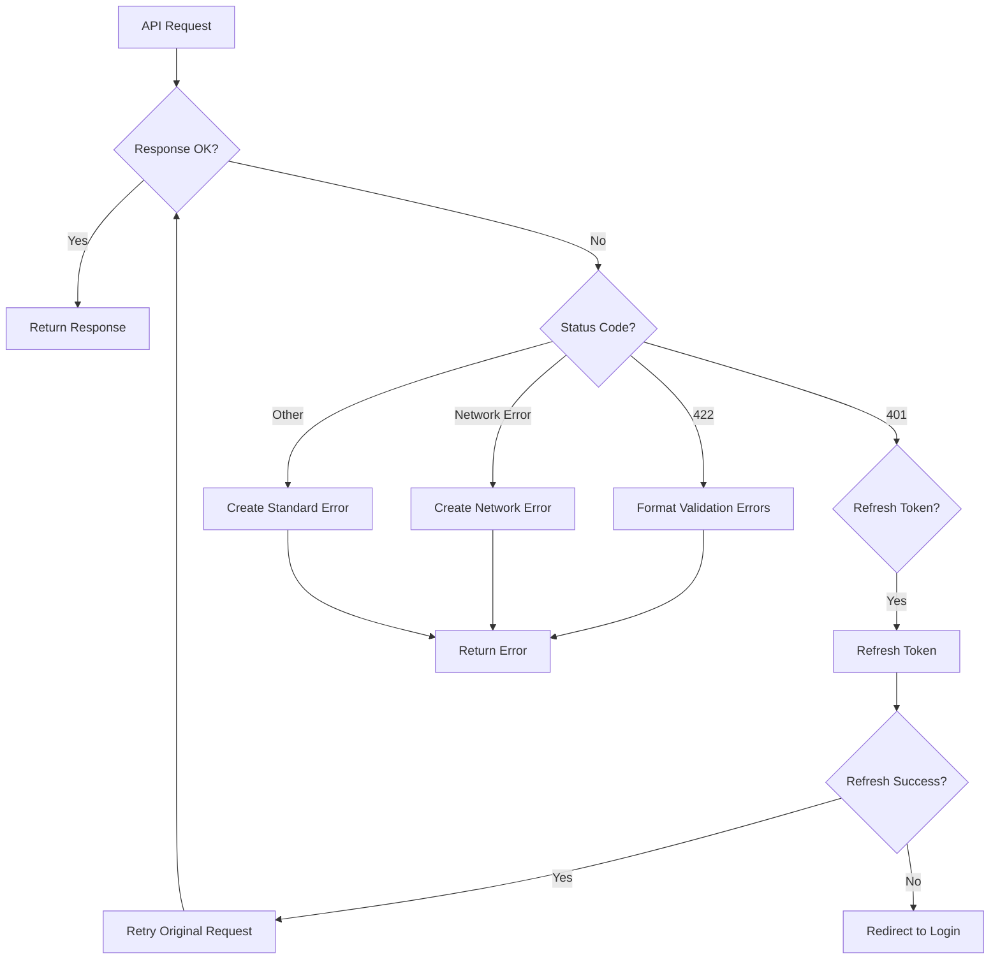

# API Client Library Design Document

## Overview

This document outlines the design for a centralized API client library for the web application. The library will provide a consistent interface for making API requests to the backend, handling authentication, error handling, response formatting, and request state management. It aims to improve code maintainability, reduce duplication, and ensure consistent error handling across the application.

## Architecture

The API client library will follow a modular architecture with the following key components:

1. **Core Client**: The foundation of the library that handles HTTP requests, authentication, and common functionality.
2. **Endpoint Definitions**: Type-safe definitions of API endpoints with request/response types.
3. **Request State Management**: Utilities for handling loading, error, and success states.
4. **Caching Layer**: Mechanism for caching responses and deduplicating requests.
5. **React Integration**: React hooks and components for seamless integration with React components.

### High-Level Architecture Diagram



## Components and Interfaces

### Core Client

The Core Client will be responsible for making HTTP requests and handling common functionality like authentication and error handling.

```typescript
interface ApiClientConfig {
  baseUrl: string;
  defaultHeaders?: Record<string, string>;
  timeout?: number;
  retryConfig?: RetryConfig;
}

interface RetryConfig {
  maxRetries: number;
  retryDelay: number;
  retryStatusCodes: number[];
}

class ApiClient {
  constructor(config: ApiClientConfig);
  
  async request<T>(config: RequestConfig): Promise<ApiResponse<T>>;
  async get<T>(url: string, config?: RequestConfig): Promise<ApiResponse<T>>;
  async post<T>(url: string, data?: any, config?: RequestConfig): Promise<ApiResponse<T>>;
  async put<T>(url: string, data?: any, config?: RequestConfig): Promise<ApiResponse<T>>;
  async patch<T>(url: string, data?: any, config?: RequestConfig): Promise<ApiResponse<T>>;
  async delete<T>(url: string, config?: RequestConfig): Promise<ApiResponse<T>>;
}
```

### Authentication Manager

The Authentication Manager will handle token management, including storage, refresh, and automatic inclusion in requests.

```typescript
interface AuthConfig {
  tokenStorage: TokenStorage;
  loginUrl: string;
  refreshUrl: string;
  onAuthError?: () => void;
}

interface TokenStorage {
  getToken(): string | null;
  setToken(token: string): void;
  clearToken(): void;
  getRefreshToken(): string | null;
  setRefreshToken(token: string): void;
}

class AuthManager {
  constructor(config: AuthConfig);
  
  getAuthHeader(): Record<string, string> | null;
  async refreshToken(): Promise<boolean>;
  handleAuthError(error: ApiError): Promise<boolean>;
  logout(): void;
}
```

### Endpoint Definitions

Endpoints will be defined in a type-safe manner using TypeScript interfaces.

```typescript
interface EndpointDefinition<TRequest, TResponse> {
  method: 'GET' | 'POST' | 'PUT' | 'DELETE' | 'PATCH';
  url: string | ((params: any) => string);
  headers?: Record<string, string>;
  cacheConfig?: CacheConfig;
}

interface CacheConfig {
  enabled: boolean;
  ttl?: number;
  invalidateOn?: string[];
}

// Example endpoint definition
const getUserEndpoint: EndpointDefinition<void, User> = {
  method: 'GET',
  url: '/users/me',
  cacheConfig: {
    enabled: true,
    ttl: 300000, // 5 minutes
    invalidateOn: ['updateUser', 'logout']
  }
};
```

### Request State Management

The library will provide utilities for managing request states in a consistent way.

```typescript
interface RequestState<T> {
  data: T | null;
  isLoading: boolean;
  isError: boolean;
  error: ApiError | null;
  isSuccess: boolean;
}

function createRequestState<T>(): RequestState<T>;
function setLoading<T>(state: RequestState<T>): RequestState<T>;
function setSuccess<T>(state: RequestState<T>, data: T): RequestState<T>;
function setError<T>(state: RequestState<T>, error: ApiError): RequestState<T>;
```

### Caching Layer

The caching layer will handle response caching and request deduplication.

```typescript
interface CacheEntry<T> {
  data: T;
  timestamp: number;
  ttl: number;
}

class CacheManager {
  constructor(config?: CacheConfig);
  
  get<T>(key: string): CacheEntry<T> | null;
  set<T>(key: string, data: T, ttl?: number): void;
  invalidate(key: string): void;
  invalidateByTags(tags: string[]): void;
  clear(): void;
}

class RequestDeduplicator {
  deduplicate<T>(key: string, requestFn: () => Promise<T>): Promise<T>;
  cancelRequest(key: string): void;
}
```

### React Integration

The library will provide React hooks for easy integration with React components.

```typescript
function useApiRequest<TRequest, TResponse>(
  endpoint: EndpointDefinition<TRequest, TResponse>,
  params?: TRequest,
  options?: UseApiRequestOptions
): {
  data: TResponse | null;
  isLoading: boolean;
  isError: boolean;
  error: ApiError | null;
  isSuccess: boolean;
  refetch: () => Promise<void>;
};

function useMutation<TRequest, TResponse>(
  endpoint: EndpointDefinition<TRequest, TResponse>,
  options?: UseMutationOptions
): {
  mutate: (data: TRequest) => Promise<TResponse>;
  isLoading: boolean;
  isError: boolean;
  error: ApiError | null;
  isSuccess: boolean;
  reset: () => void;
};
```

## Data Models

### API Response

```typescript
interface ApiResponse<T> {
  data: T;
  status: number;
  headers: Record<string, string>;
}
```

### API Error

```typescript
interface ApiError {
  message: string;
  status?: number;
  code?: string;
  validationErrors?: Record<string, string[]>;
  isNetworkError?: boolean;
}
```

### Validation Errors

```typescript
interface ValidationError {
  field: string;
  message: string;
}

interface ValidationErrors {
  [field: string]: string[];
}
```

## Error Handling

The API client library will implement a comprehensive error handling strategy:

1. **Error Classification**: Errors will be classified into different types (network, authentication, validation, server, etc.).
2. **Standardized Error Format**: All errors will be transformed into a consistent format.
3. **Automatic Token Refresh**: When a 401 error occurs, the library will attempt to refresh the token and retry the request.
4. **Validation Error Formatting**: Validation errors will be formatted for easy integration with form libraries.

### Error Handling Flow



## Testing Strategy

The testing strategy for the API client library will include:

1. **Unit Tests**: Testing individual components in isolation.
2. **Integration Tests**: Testing the interaction between components.
3. **Mock Server**: Using a mock server to simulate API responses.
4. **React Testing**: Testing React hooks and components with React Testing Library.

### Test Coverage Goals

- Core Client: 100% coverage
- Authentication Manager: 100% coverage
- Caching Layer: 90% coverage
- React Hooks: 90% coverage

## Design Decisions and Rationales

### 1. Modular Architecture

**Decision**: Implement a modular architecture with clear separation of concerns.

**Rationale**: This approach allows for better maintainability and testability. Components can be developed, tested, and updated independently.

### 2. TypeScript for Type Safety

**Decision**: Use TypeScript for strong typing of requests and responses.

**Rationale**: TypeScript provides compile-time type checking, improving developer experience with autocomplete and reducing runtime errors.

### 3. Token Refresh Strategy

**Decision**: Implement automatic token refresh with request retry.

**Rationale**: This provides a seamless authentication experience for users without requiring them to log in again when their token expires.

### 4. Caching with TTL and Invalidation Tags

**Decision**: Implement a caching system with time-to-live (TTL) and invalidation tags.

**Rationale**: This approach balances performance optimization with data freshness. Invalidation tags allow for targeted cache invalidation when related data changes.

### 5. React Hooks for State Management

**Decision**: Provide React hooks for request state management.

**Rationale**: React hooks provide a clean, declarative API for managing request states in React components, reducing boilerplate code and improving component readability.

### 6. Request Deduplication

**Decision**: Implement request deduplication for identical in-flight requests.

**Rationale**: This prevents unnecessary network requests, improving performance and reducing server load.

### 7. Environment-based Configuration

**Decision**: Use environment variables for API configuration.

**Rationale**: This allows for different configurations in development, testing, and production environments without code changes.